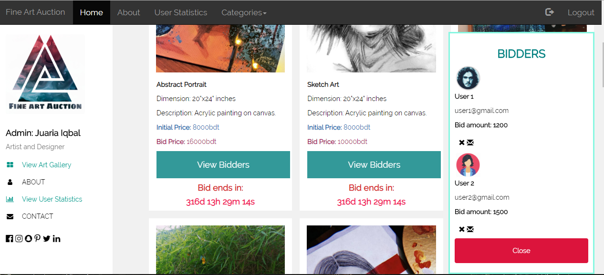

# Auction-System

Art Auction system is platform where the Admin can post images of artworks and the Registered Users can place their biddings until the bidding session expires. It is created using php, javascript and css. 

The screenshot below is the UI of this system, where the users can sign up or login.

Below are the screenshots of the Admin profile, where the admin can see the statistics and the user who bid.

Finally, the User profile where they can bid by providing credentials with which the users regitered in the system.

